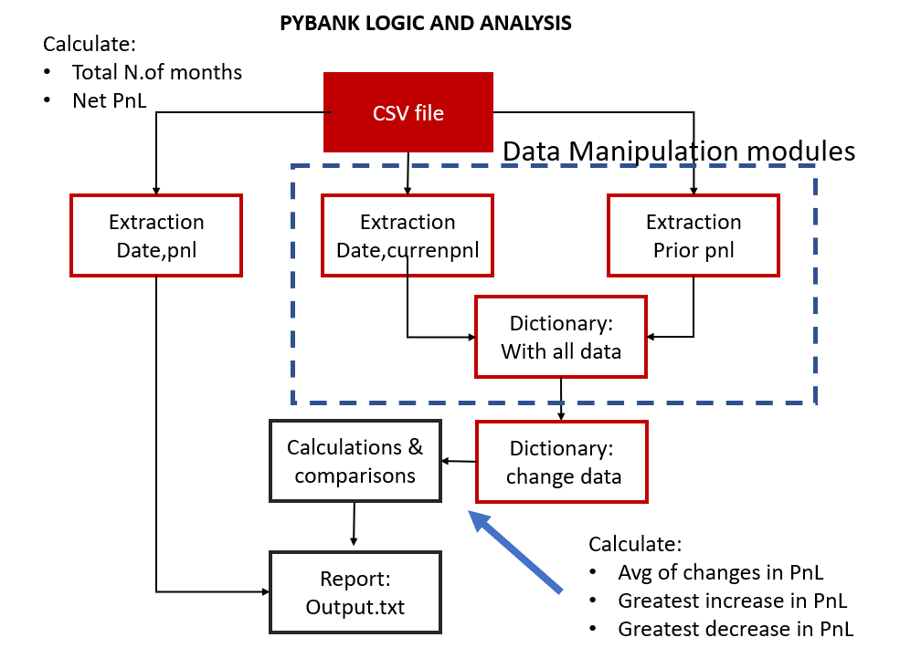

# Python_Homework

## Table of Contents
* General Information
    * PyBank Logic
    * PyRamen Logic

* Libraries 
* Projects folder structure

## General Information

* On this homework assigment, both (PyBank and PyRamen) required of utilizing two of the most complex topics learned on week 2 : csv data extraction and list and/or dictionary looping.  

### PyBank Logic

* The project was divided in 2 parts:
    * Part A: consisted of the data collection and analysis to produce the first 2 items on the list: Total number of months and the net profit/loss of the entire file.
    * Part B: consisted of the data collection and analysis to obtain the monthly delta (profit/loss change per month) which, in turn, produced the answers for the rest of the requirements: avg. change on Profit/loss, greatest increase in profit (with the month that happened) and greates decrease in loss (with the month that it occured).
    * The block diagram (PyBank Logic and Analysis), shows the sequence or steps used to get in one dictionary: prior month PnL, current month PnL and Date from an initial dataset of month and PnL.  To get one dictionary with prior month and current month in same list, 2 extractions were processed from the budget_data.csv file, one extraction got skipped 1 row (the header) to generate prior PnL, while the second extraction skipped 2 rows (the header and the first data row) to generate current PnL and date. This was done based on the fact that the first data row has no prior month to compare it against.  
    * Once, all the data needed to obtain change (dictionary: "finrec"), a for loop calculates the change on each data row (month) and populated a dictionary named: "changes".
    * Finally, on "changes dictionary", a series of if statement compared each month to obtain the average change, the greatest increase in profits and the greatest decrease in profits (both with the month that they occured). 
    * Lastly, an output txt.file was generated to include the five metrics. 

### PyRamen Logic

* This project consists of 3 stages: data extraction, data manipulation and report preparation.
* Data extraction: consisted on calling a customized function imported from the attached module to extract the data from 2 csv files (sales and menu) and store each data in lists.
* Data manipulation: in a subsequent step, the sales list was looped in to initialize a dictionary (report) and looping into the menu list compared to obtain the requested metrics.
* Report preparation: this consisted of a loop into the report dictionary to filewrite each line to produce a txt file.  
* This projects has 2 files, that run identically: one calls a function from the library (main2function.ipynb), while the file names main.ipynb has the complete code. Both, produce same output.

## Libraries:

* To complete both projects, 2 external libraries and 1 customized libraries were used:
* The external libraries were: csv and pathlib, while the customized library ext_data_interface.py was created to include regularly used functions (for csv files data extraction).

## Projects folder structures:

* Both projects folder structure are configured as follows: 

 

*  Main folder: which holds the jupyter file that runs the applications.

 
   * 3 sub-folders: Libs (store function modules), Outputs (output files) and Resources (project imputs).

  * 1 python cache folder (_pycache_) autogenerated when the functions were called from main file.

 
   * auxiliary folders (optional) for test outputs, and txt codes (these were created to preserve the work in the event of unexpected shutdowns between repository pushes).

 

* It is worth mentioning, that the ext_data_interface module is located twice in the project:1) main folder along with the main program and 2) nside the lib folder. This was done, to avoid "NameErrors" when calling functions from external files. 

______________________________________
## Sources:
[1] (https://realpython.com/iterate-through-dictionary-python/)